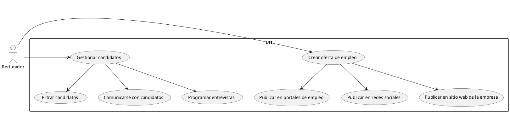
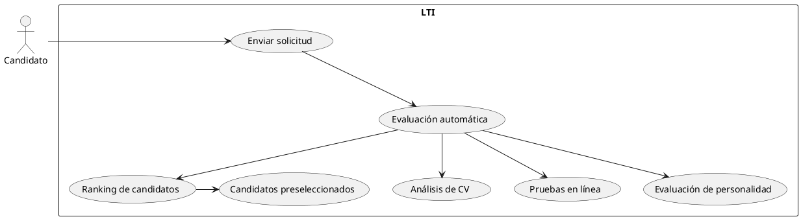
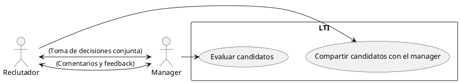
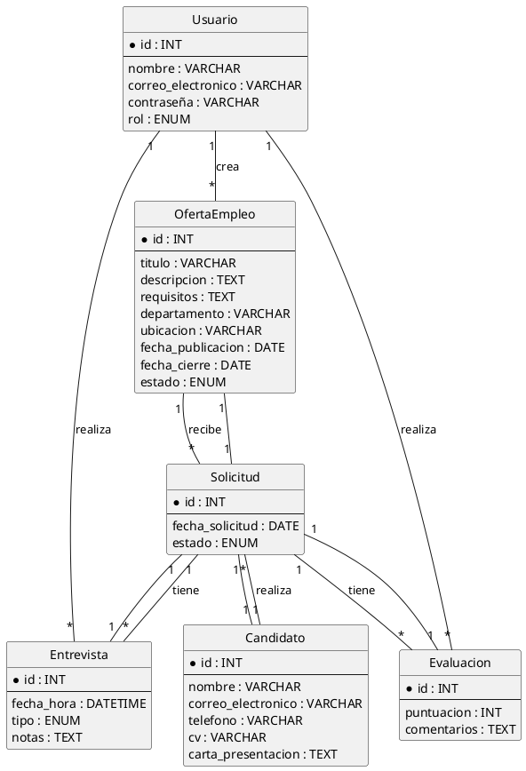
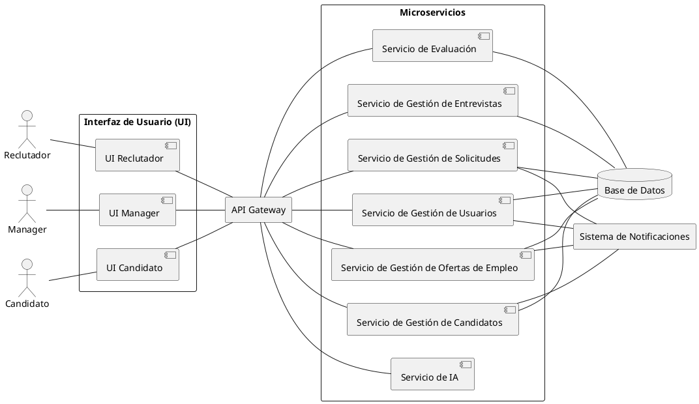
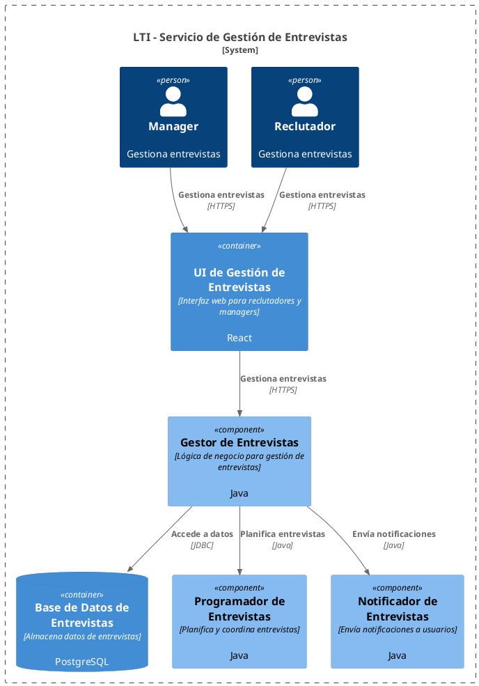

¡¡¡He cogido esta parte prestada!!! 
Todo lo relativo a la parte 2 está en el fichero con mi nombre.

## LTI: El ATS Inteligente para la Nueva Era de la Gestión del Talento

### 1. Descripción Breve de LTI

LTI es un Applicant Tracking System (ATS) de última generación diseñado para revolucionar la forma en que los departamentos de Recursos Humanos gestionan el proceso de contratación. Al combinar la potencia de la inteligencia artificial con una interfaz intuitiva y herramientas de colaboración en tiempo real, LTI agiliza cada etapa del ciclo de vida del reclutamiento, desde la creación de ofertas de empleo hasta la incorporación de nuevos empleados.

### 2. Valor Añadido de LTI

- **Eficiencia radical**: LTI automatiza tareas repetitivas y administrativas, liberando a los reclutadores para que se centren en actividades estratégicas de mayor valor, como la búsqueda de talento y la creación de experiencias positivas para los candidatos.
- **Colaboración fluida**: LTI facilita la comunicación y la colaboración en tiempo real entre reclutadores y managers, garantizando que todos estén alineados y que las decisiones se tomen de manera conjunta y ágil.
- **Decisiones basadas en datos**: LTI proporciona información y análisis detallados sobre el rendimiento del proceso de contratación, lo que permite a los equipos de Recursos Humanos identificar áreas de mejora y tomar decisiones más informadas.
- **Experiencia del candidato excepcional**: LTI ofrece una experiencia de candidato moderna y personalizada, con comunicaciones claras, procesos transparentes y oportunidades para que los candidatos muestren su talento de la mejor manera posible.

### 3. Ventajas Competitivas de LTI

- **IA en el corazón**: LTI utiliza algoritmos de IA avanzados para optimizar la búsqueda de candidatos, evaluar automáticamente las habilidades y la experiencia, y predecir el éxito de los nuevos empleados.
- **Integración perfecta**: LTI se integra fácilmente con otras herramientas y plataformas utilizadas por los departamentos de Recursos Humanos, como sistemas de gestión de nóminas, portales de empleo y redes sociales profesionales.
- **Personalización total**: LTI se adapta a las necesidades específicas de cada empresa, permitiendo a los equipos de Recursos Humanos configurar flujos de trabajo, crear plantillas personalizadas y definir criterios de selección específicos.
- **Escalabilidad y flexibilidad**: LTI es una solución escalable que puede crecer y adaptarse a medida que las empresas evolucionan. Además, su arquitectura flexible permite a las empresas personalizar la plataforma para satisfacer sus necesidades únicas.

### 4. Funciones Principales de LTI

- **Gestión inteligente de ofertas de empleo**: LTI simplifica la creación y publicación de ofertas de empleo en múltiples canales, incluyendo portales de empleo, redes sociales y el sitio web de la empresa.
- **Búsqueda y selección de candidatos**: LTI utiliza IA para identificar a los candidatos más relevantes en función de las habilidades, la experiencia y otros criterios de selección.
- **Evaluación automatizada de candidatos**: LTI evalúa automáticamente las habilidades y la experiencia de los candidatos a través de pruebas en línea, evaluaciones de personalidad y análisis de currículums.
- **Gestión de entrevistas**: LTI facilita la programación y la gestión de entrevistas, incluyendo la coordinación de horarios, el envío de recordatorios y la recopilación de comentarios de los entrevistadores.
- **Colaboración en tiempo real**: LTI permite a los reclutadores y managers colaborar en tiempo real en la toma de decisiones, compartiendo comentarios, evaluando candidatos y tomando decisiones de contratación conjuntas.
- **Análisis y generación de informes**: LTI proporciona información y análisis detallados sobre el rendimiento del proceso de contratación, incluyendo métricas clave como el tiempo de contratación, el costo por contratación y la calidad de las contrataciones.

## Lean Canvas para LTI

**1. Problema**

- Procesos de contratación lentos e ineficientes.
- Dificultad para encontrar candidatos cualificados.
- Falta de colaboración entre reclutadores y managers.
- Experiencias de candidato negativas.
- Dificultad para tomar decisiones basadas en datos.

**2. Segmentos de clientes**

- Empresas de todos los tamaños.
- Departamentos de Recursos Humanos.
- Reclutadores.
- Managers de contratación.

**3. Propuesta de valor**

- Acelerar el proceso de contratación.
- Mejorar la calidad de las contrataciones.
- Facilitar la colaboración entre reclutadores y managers.
- Optimizar la experiencia del candidato.
- Proporcionar información detallada para la toma de decisiones.

**4. Solución**

- Plataforma ATS intuitiva con IA integrada.
- Automatización de tareas repetitivas.
- Herramientas de colaboración en tiempo real.
- Análisis e informes avanzados.
- Integración con otras plataformas de RRHH.

**5. Canales**

- Marketing de contenidos (blog, ebooks, webinars).
- Redes sociales.
- Publicidad online.
- Eventos del sector.
- Asociaciones con empresas de RRHH.

**6. Flujo de ingresos**

- Suscripciones mensuales o anuales.
- Planes de precios escalonados según el tamaño de la empresa y las funcionalidades.
- Servicios adicionales como la integración con otras plataformas o la formación personalizada.

**7. Métricas clave**

- Número de clientes.
- Tasa de retención de clientes.
- Ingresos recurrentes mensuales (MRR).
- Costo de adquisición de clientes (CAC).
- Tiempo de contratación.
- Calidad de las contrataciones.

**8. Ventaja competitiva**

- IA avanzada para la búsqueda, evaluación y predicción del éxito de los candidatos.
- Enfoque en la colaboración en tiempo real entre reclutadores y managers.
- Experiencia de usuario intuitiva y moderna.
- Integración perfecta con otras herramientas de RRHH.

**9. Costes**

- Desarrollo y mantenimiento de la plataforma.
- Marketing y ventas.
- Salarios del equipo.
- Infraestructura y servidores.

## Casos de Uso Principales de LTI

A continuación, se describen tres casos de uso principales de LTI, con sus respectivos diagramas:

**1. Publicación y gestión de ofertas de empleo:**

- **Descripción:** LTI simplifica la creación, publicación y gestión de ofertas de empleo en múltiples canales.
- **Diagrama:**

**2. Evaluación y selección de candidatos:**

- **Descripción:** LTI utiliza IA para evaluar y seleccionar candidatos de forma automatizada, basándose en criterios predefinidos.
- **Diagrama:**

**3. Colaboración entre reclutadores y managers:**

- **Descripción:** LTI facilita la colaboración en tiempo real entre reclutadores y managers durante el proceso de selección.
- **Diagrama:**

## Modelo de Datos para LTI

El siguiente modelo de datos describe las entidades principales, sus atributos y las relaciones entre ellas en el sistema LTI:

**Entidades:**

- **Usuario:**
  - `id` (INT, primary key)
  - `nombre` (VARCHAR)
  - `correo_electronico` (VARCHAR)
  - `contraseña` (VARCHAR)
  - `rol` (ENUM: 'reclutador', 'manager', 'administrador', 'candidato')
- **Oferta de Empleo:**
  - `id` (INT, primary key)
  - `titulo` (VARCHAR)
  - `descripcion` (TEXT)
  - `requisitos` (TEXT)
  - `departamento` (VARCHAR)
  - `ubicacion` (VARCHAR)
  - `fecha_publicacion` (DATE)
  - `fecha_cierre` (DATE)
  - `estado` (ENUM: 'abierta', 'cerrada', 'archivada')
  - `id_usuario_creador` (INT, foreign key to Usuario)
- **Candidato:**
  - `id` (INT, primary key)
  - `nombre` (VARCHAR)
  - `correo_electronico` (VARCHAR)
  - `telefono` (VARCHAR)
  - `cv` (VARCHAR, URL al archivo del CV)
  - `carta_presentacion` (TEXT)
- **Solicitud:**
  - `id` (INT, primary key)
  - `id_candidato` (INT, foreign key to Candidato)
  - `id_oferta_empleo` (INT, foreign key to Oferta de Empleo)
  - `fecha_solicitud` (DATE)
  - `estado` (ENUM: 'recibida', 'en_revision', 'entrevistado', 'rechazado', 'contratado')
- **Entrevista:**
  - `id` (INT, primary key)
  - `id_solicitud` (INT, foreign key to Solicitud)
  - `id_entrevistador` (INT, foreign key to Usuario)
  - `fecha_hora` (DATETIME)
  - `tipo` (ENUM: 'telefonica', 'presencial', 'videoconferencia')
  - `notas` (TEXT)
- **Evaluacion:**
  - `id` (INT, primary key)
  - `id_solicitud` (INT, foreign key to Solicitud)
  - `id_evaluador` (INT, foreign key to Usuario)
  - `puntuacion` (INT)
  - `comentarios` (TEXT)

**Relaciones:**

- Un **Usuario** puede crear muchas **Ofertas de Empleo** (uno a muchos).
- Un **Candidato** puede realizar muchas **Solicitudes** (uno a muchos).
- Una **Oferta de Empleo** puede recibir muchas **Solicitudes** (uno a muchos).
- Una **Solicitud** pertenece a un **Candidato** y a una **Oferta de Empleo** (uno a uno).
- Una **Solicitud** puede tener muchas **Entrevistas** (uno a muchos).
- Una **Entrevista** pertenece a una **Solicitud** (uno a uno).
- Una **Solicitud** puede tener muchas **Evaluaciones** (uno a muchos).
- Una **Evaluacion** pertenece a una **Solicitud** (uno a uno).

**Diagrama Entidad-Relación:**

## Diseño del Sistema a Alto Nivel para LTI

### Explicación del Diseño

LTI se basa en una arquitectura de microservicios, lo que permite una mayor escalabilidad, flexibilidad y mantenimiento. El sistema se divide en varios componentes principales:

1.  **Interfaz de Usuario (UI):** Proporciona una interfaz intuitiva y fácil de usar para reclutadores, managers y candidatos. La UI se comunica con el backend a través de APIs RESTful.

2.  **API Gateway:** Actúa como un punto de entrada único para todas las solicitudes, gestionando la autenticación, autorización y enrutamiento de las solicitudes a los microservicios correspondientes.

3.  **Microservicios:**

    - **Servicio de Gestión de Usuarios:** Gestiona la creación, autenticación y autorización de usuarios.
    - **Servicio de Gestión de Ofertas de Empleo:** Permite la creación, publicación y gestión de ofertas de empleo.
    - **Servicio de Gestión de Candidatos:** Almacena y gestiona la información de los candidatos.
    - **Servicio de Gestión de Solicitudes:** Gestiona las solicitudes de empleo y su estado.
    - **Servicio de Gestión de Entrevistas:** Permite la programación y gestión de entrevistas.
    - **Servicio de Evaluación:** Gestiona las evaluaciones de los candidatos.
    - **Servicio de IA:** Proporciona funcionalidades de inteligencia artificial, como el análisis de CVs, la búsqueda de candidatos y la evaluación de habilidades.

4.  **Base de Datos:** Almacena todos los datos del sistema, incluyendo información de usuarios, ofertas de empleo, candidatos, solicitudes, entrevistas y evaluaciones.

5.  **Sistema de Notificaciones:** Envía notificaciones a los usuarios sobre eventos importantes, como nuevas solicitudes, entrevistas programadas o cambios en el estado de una solicitud.

### Diagrama del Sistema

## Diagrama C4 para el Servicio de Gestión de Entrevistas

### Explicación del diagrama C4:

- **Contexto:** El diagrama muestra el Servicio de Gestión de Entrevistas dentro del sistema LTI, interactuando con actores externos (Reclutador y Manager) a través de las interfaces de usuario correspondientes.
- **Contenedores:** Se definen los contenedores principales: la interfaz web de gestión de entrevistas, la base de datos de entrevistas y los componentes de microservicios.
- **Componentes:** Se detallan los componentes internos del servicio: el Gestor de Entrevistas (que contiene la lógica de negocio), el Programador de Entrevistas y el Notificador de Entrevistas.
- **Relaciones:** Se muestran las relaciones entre los componentes y contenedores, indicando la tecnología y el protocolo utilizado en cada interacción.

Este diagrama C4 proporciona una visión detallada del Servicio de Gestión de Entrevistas, mostrando sus componentes internos y cómo interactúan entre sí y con el resto del sistema.

### Diagrama C4

